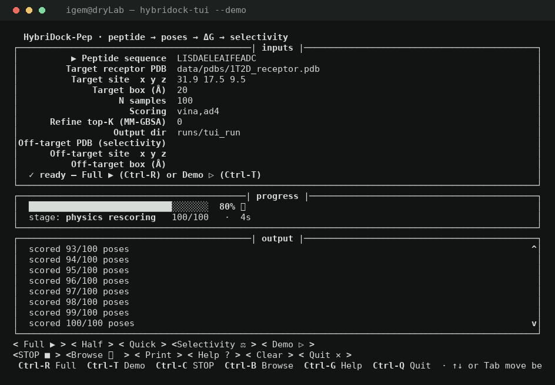
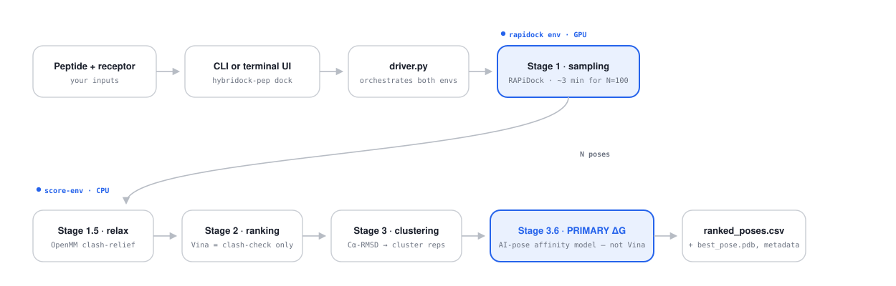
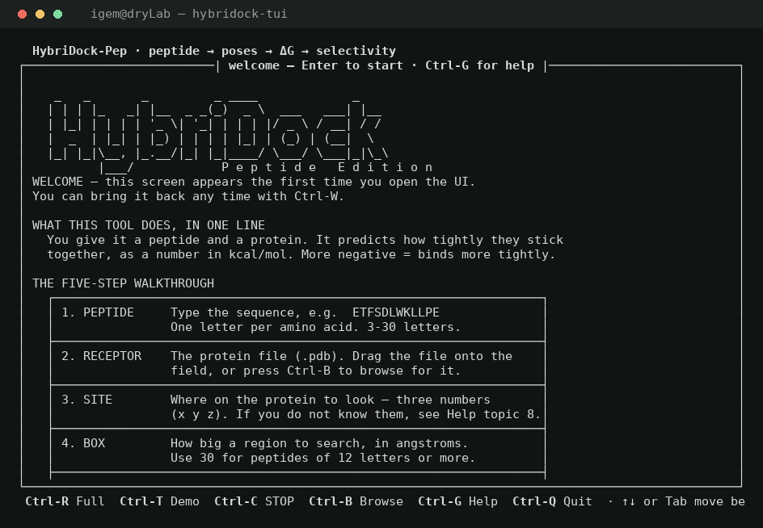
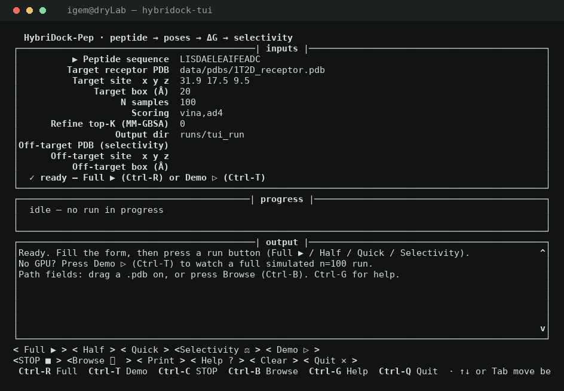
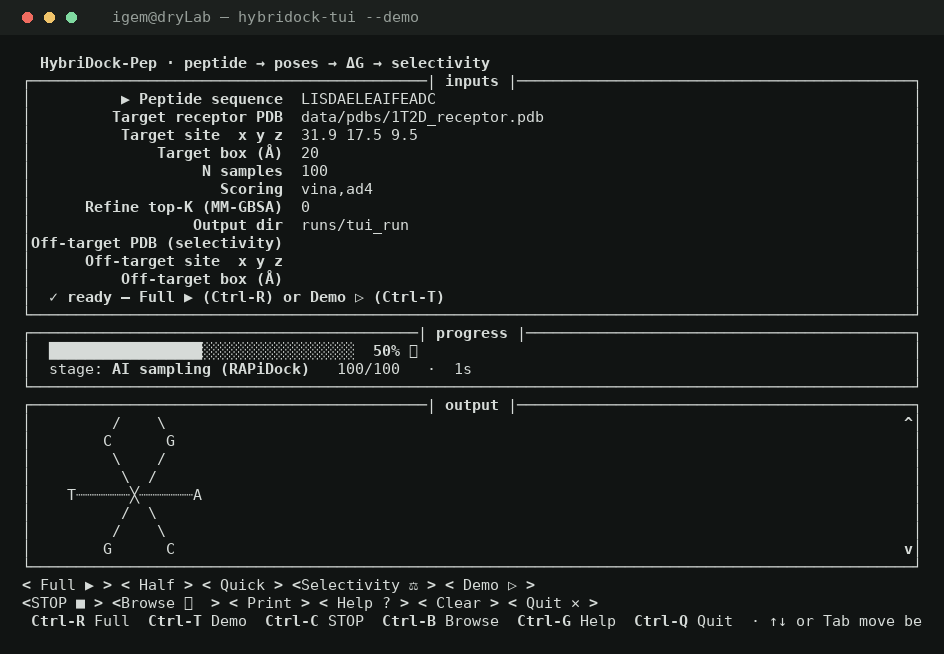
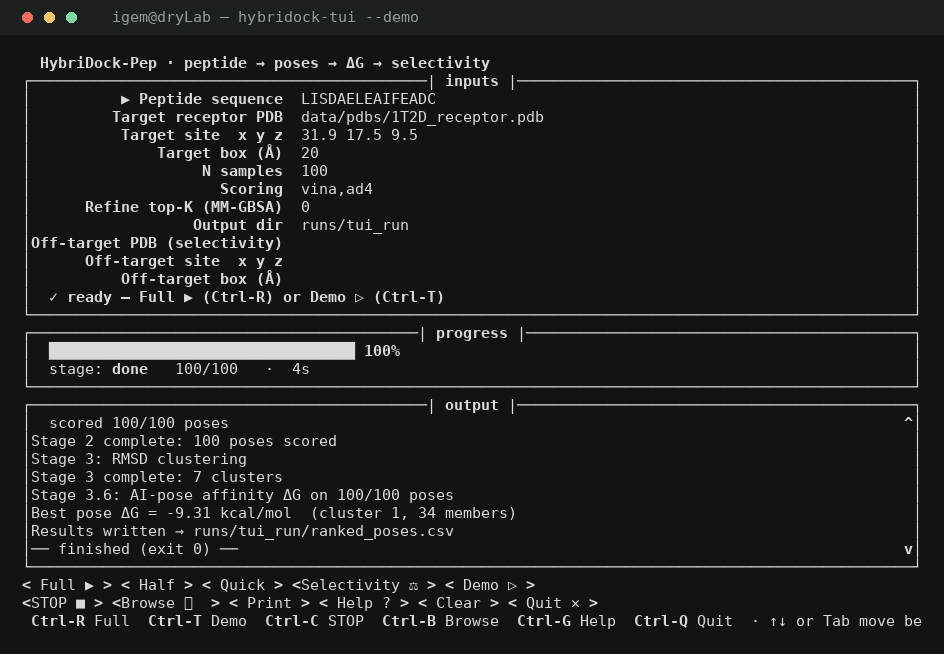
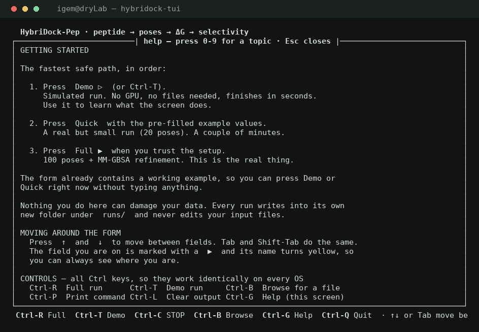
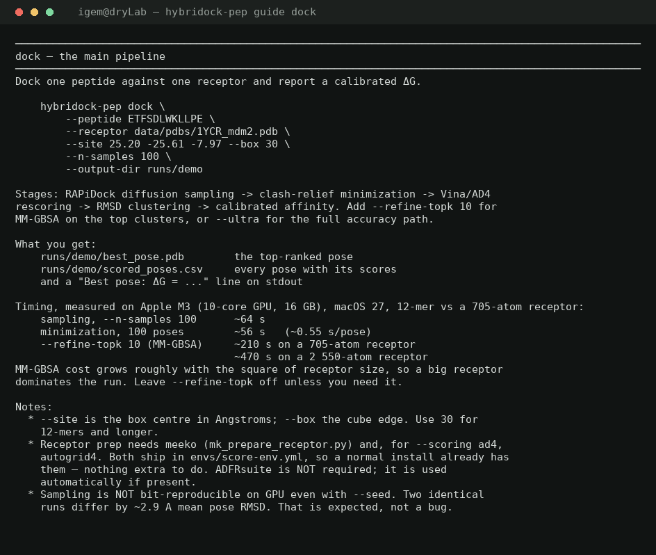

# HybriDock-Pep

> **peptide → AI poses → calibrated ΔG (kcal/mol) → selectivity ΔΔG** · diffusion sampling + physics/learned-geometry rescoring · MIT · CUDA│ROCm│oneAPI│Metal│CPU · leakage-free benchmarked

**A general protein–peptide docking and scoring tool: AI diffusion sampling + a learned-geometry affinity model (+ optional MM-GBSA) — fused into a single CLI, MIT-licensed, cross-platform.**

[](LICENSE)
[](https://www.python.org/downloads/)
[](https://doi.org/10.5281/zenodo.21680573)
[](https://youtu.be/ro9CukQCW44)



This is the real terminal UI (`./launch_ui.sh`) — a live screenshot, not a mockup: the input form
on top, a progress bar and stage label in the middle, scored poses streaming in below. One command
gets you here — see [Get started](#get-started).

## Table of contents

1. [What this does](#what-this-does)
2. [How it works — the pipeline](#how-it-works--the-pipeline)
3. [Get started](#get-started)
4. [Usage — the six subcommands](#usage--the-six-subcommands)
5. [Advanced / manual install](#advanced--manual-install)
6. [Repository structure](#repository-structure)
7. [Testing](#testing)
8. [The claims — measured in kcal/mol, leakage-free](#the-claims--measured-in-kcalmol-leakage-free)
9. [Roadmap](#roadmap--to-do)
10. [Project status](#project-status) · [Citations](#citations) · [License](#license)

---

## What this does

Give it a peptide sequence and a protein structure (a PDB file). It hands back ranked 3D poses of
how the peptide binds, a calibrated binding strength (**ΔG**, in kcal/mol — more negative means it
sticks tighter), and — its standout feature — a **selectivity score**: does this peptide prefer
target A over target B? That last one matters for things like a diagnostic peptide that needs to
grab onto a parasite protein but leave the human version alone.

Built for the **iGEM workflow scale**: dozens of candidate peptides against one or two targets,
minutes per peptide, on a single GPU or even a laptop CPU.

## How it works — the pipeline

Two stages chained together: an AI diffusion model proposes 3D poses, then a physics + learned-geometry
rescorer turns those poses into a real, comparable ΔG. This is the *actual* code path
(`driver.py::run_dock`), not a simplified sketch — including which of the two conda environments
each stage actually runs in, and exactly where Vina's role ends and the real score begins:



**The headline ΔG is the AI-pose affinity model — not Vina.** Stage 3.6 scores every pose with a
geometry-feature model tuned on real RAPiDock/AI poses; that's the `delta_g` column and the
"Best pose ΔG" you see printed. **Vina only does clash relief** (Stage 2, rescuing RAPiDock's
occasionally-clashing poses) — its own score is raw telemetry, never the reported affinity, and
**AD4 is off by default**. Already have a crystal-quality pose and want to skip docking entirely?
[`crystal-score`](#crystal-score--score-an-existing-crystal-pose) runs the sibling crystal-tuned
model directly on it.

`--refine-topk K` genuinely relaxes the top poses: Stage 3.5 energy-minimizes the top-*K* cluster
representatives in GBn2 implicit solvent and reports that as a physically-grounded absolute-energy
estimate — a sanity check on final candidates, not a replacement ranking (see
[Usage](#dock--end-to-end-docking--scoring) for why it doesn't out-rank the learned scorer).

It's a **two-stage hybrid**, not a from-scratch model: an AI diffusion model (RAPiDock-Reloaded)
samples poses, a physics + learned-geometry rescorer turns those into ΔG. Three things it does that
off-the-shelf tools don't combine: **(1)** it's the best non-FEP/LIE peptide affinity scorer we can
find a fair baseline for; **(2)** anchoring to a few measured references on-target lifts within-receptor
accuracy from *r*≈0.25 to ≈0.55; and **(3)** it ships a structure-based *selectivity* ΔΔG a
sequence-only ML scorer structurally can't provide. Full evidence: [The claims](#the-claims--measured-in-kcalmol-leakage-free).

---

## Get started

Prefer a video? **[Setup and first run — full walkthrough](https://youtu.be/ro9CukQCW44)** covers
everything in this section on a clean machine.

### 1. Install

**macOS, Linux, or WSL2:**

```bash
git clone --recurse-submodules https://github.com/Tasty-Ramen2010/hybridock-pep.git
cd hybridock-pep
./install.sh
```

**Windows:** double-click `install.bat` (or run it from PowerShell/CMD) once — it sets up WSL2 for
you, then runs `install.sh` inside it. After that, open the WSL2/Ubuntu terminal (search "Ubuntu"
in the Start menu, or type `wsl` in any Windows terminal) — **every command in this README runs
there**, not in PowerShell or CMD.

`install.sh` does everything: installs conda if you don't have it, creates both conda environments
with the right PyTorch build for your GPU, downloads and checksum-verifies the RAPiDock model
weights (~55 MB, from Zenodo), checks the receptor-prep tooling, runs a smoke test, and finishes by
opening the guided terminal UI.

1. Budget **15–30 minutes** — most of it is conda quietly solving dependencies plus a PyTorch
   download. If it looks frozen on a line like `Solving environment: \` for a few minutes, that's
   normal; don't Ctrl-C it.
2. It's safe to re-run any time, e.g. after `git pull` — it skips whatever's already installed
   instead of redoing it.
3. In every *new* terminal after that, run `conda activate score-env` before using the CLI.

| flag | effect |
|---|---|
| `--no-ui` | don't auto-launch the UI at the end — useful for scripted or headless installs |
| `--force` | recreate the conda environments from scratch |
| `--skip-rapidock` | scoring environment only, skips the GPU sampling environment |

### 2. Check it worked

```bash
hybridock-pep crystal-score \
    --receptor data/pdbs/1YCR_mdm2.pdb \
    --peptide-pdb data/pdbs/1YCR_peptide.pdb \
    --peptide ETFSDLWKLLPE
```

Expect `Crystal ΔG = -9.28 kcal/mol`. Anything from **−8 to −11** means a healthy install — the
published experimental value for this real complex (MDM2/p53, PDB `1YCR`) is about −8.5. This
scores an already-known pose directly (no GPU needed), so it's the fastest way to confirm the
scoring stack works. Repeated runs on the same machine give you the exact same number.

Want to prove the core math holds too, with zero downloads? `make verify` runs the offline,
30-second sanity checks (double-difference, anchoring, selectivity).

### 3. Run something real

The plain command line:

```bash
hybridock-pep dock \
    --peptide ETFSDLWKLLPE --receptor data/pdbs/1YCR_mdm2.pdb \
    --site 25.20 -25.61 -7.97 --box 30 --n-samples 20 \
    --output-dir runs/demo
```

About 2 minutes on an Apple M3. This is the one part of a run that needs the GPU sampling
environment (already installed above, unless you passed `--skip-rapidock`). Results land in
`runs/demo/best_pose.pdb` and `runs/demo/ranked_poses.csv`.

> `--site` is the **centre of the binding pocket**, in ångströms, and must match the receptor you
> passed — getting it wrong is the most common mistake (the run finishes but searched empty space).
> See `hybridock-pep guide dock`, or help topic 8 in the UI.

Same thing, guided — the terminal UI:

```bash
./launch_ui.sh
```

walks you through the same fields with a live progress bar. Its `--demo` mode simulates a full run
in a few seconds with **no GPU at all** — the fastest way to see what a real run looks like before
spending GPU time on one:

```bash
./launch_ui.sh --demo
```

Real screenshots, not mockups — first launch, the form, a long-wait ASCII art break mid-run, a
finished demo, and the help screen:

<table>
<tr>
<td width="33%"></td>
<td width="33%"></td>
<td width="33%"></td>
</tr>
<tr>
<td width="33%"></td>
<td width="33%"></td>
<td width="33%"></td>
</tr>
</table>

| key | action |
|---|---|
| `↑` / `↓` | move between form fields (Tab / Shift-Tab also work) |
| `Ctrl-C` | **STOP** — abort a running job and everything it spawned |
| `Ctrl-G` | help — 10 topics, including selectivity, crystal scoring, AI vs physics scoring |
| `Ctrl-T` | Demo run (no GPU) |
| `Ctrl-R` | Full run |
| `Ctrl-B` | browse for a file (or just drag a `.pdb` onto any path field) |
| `Ctrl-Q` | quit — `Ctrl-C` only stops the current run |

> The ASCII gallery isn't just for the demo — the plain CLI shows the same rotating gallery during
> a real Stage 1 wait. There are a couple of easter eggs in the terminal UI too, if you go looking
> (`Ctrl-A`, or try a familiar peptide sequence). Set `HYBRIDOCK_NO_ART=1` to turn all of it off.

### 4. Built-in help, right in the terminal

No UI needed — worked examples with real measured numbers:

```bash
hybridock-pep guide dock      # one worked example + measured timing
hybridock-pep guide prep      # receptor prep, why the backend doesn't change your ΔG
hybridock-pep guide tuning    # environment switches, Apple Silicon notes
hybridock-pep guide all
```



### 5. Run the test suite

```bash
pytest                  # fast suite — 730 passed, 72 skipped, ~20-40s
pytest -m slow          # + real Vina/OpenMM/terminal integration tests, ~55 min
pytest -k mmgbsa        # just one area
```

Skips aren't failures — they're the `slow` tier plus tests for optional tools you may not have
installed.

### Environment switches

| variable | effect |
|---|---|
| `HYBRIDOCK_RAPIDOCK_BATCH=N` | poses per diffusion step (default derived from RAM) |
| `HYBRIDOCK_MMGBSA_FAST=1` | 5.4× faster MM-GBSA; shifts ΔG by up to ~4.5 kcal/mol |
| `RAPIDOCK_DISABLE_METAL_TP=1` | disable the fused Metal kernel (A/B testing) |
| `HYBRIDOCK_NO_ART=1` | turn off the ASCII art gallery during long waits |

---

## Usage — the six subcommands

HybriDock-Pep is one CLI with six subcommands: **`dock`**, **`selectivity`**, **`reproducibility`**,
**`prep`**, **`calibrate`**, **`benchmark`**. Run `hybridock-pep <command> --help` for the full flag list.

### `dock` — end-to-end docking + scoring

```bash
hybridock-pep dock \
    --peptide ETFSDLWKLLPE \
    --receptor receptors/mdm2.pdb \
    --site 25.20 -25.61 -7.97 \   # binding-site center (x y z, Å)
    --box 30 \                    # search box edge (Å)
    --n-samples 100 \             # RAPiDock passes (default 100)
    --refine-topk 10 \            # MM-GBSA on the top-10 cluster reps
    --output-dir runs/mdm2_p53
```

The default ΔG (`delta_g`) is the **AI-pose affinity model** — Vina is clash-relief only, AD4 is off.

| Flag | What it does |
|---|---|
| `--scoring vina,ad4` | force-field backends to run (default `vina` = clash relief; add `ad4` for research telemetry). Neither is the headline ΔG. |
| `--refine-topk K` | physics **absolute-ΔG** refinement — MM-GBSA (AMBER ff14SB + GBn2) on the top-K cluster reps. Note: MM-GBSA gives a physically-grounded single-snapshot energy but **ranks worse than the learned scorer** on our data (r≈0.25 vs 0.32); use it for an absolute-energy sanity check on final candidates, not for ranking. |
| `--ultra [K]` | **ultra ranking mode** — compute `rank_score` as the mean of K feature-jittered evaluations (randomized smoothing, default K=32). Tightens within-target ranking ~+2 pts pairwise at ~K× scoring cost; does **not** improve absolute ΔG. |
| `--ensemble` | also emit the optional geometry+Vina ensemble ΔG column (research/telemetry; not the default scorer) |
| `--free-entropy` | add the free-state conformational-entropy feature (helps long/floppy peptides) |
| `--input-poses DIR` | **skip Stage 1** and score pre-generated poses (e.g. sampled on a remote CUDA box) |
| `--seed N` | deterministic run (modulo CUDA nondeterminism; logged to `run_metadata.json`) |
| `--mmgbsa-ie` / `--mmgbsa-3traj` / `--mmgbsa-dielectric EPS` | interaction-entropy term · three-trajectory MM-GBSA · custom solute dielectric |
| `--mmgbsa-cpu-only` / `--no-minimize` | force MM-GBSA onto CPU · skip the OpenMM pre-minimization |

### `selectivity` — does my peptide prefer target A over off-target B?

```bash
hybridock-pep selectivity \
    --peptide LISDAELEAIFEADC \
    --target-receptor receptors/target.pdb \
    --target-site 31.9 17.5 9.5 --target-box 25 \
    --offtarget-receptor receptors/offtarget.pdb \
    --offtarget-site 12.3 4.1 22.7 --offtarget-box 25 \
    --output-dir runs/selectivity_check
```

Returns **ΔΔG = ΔG_target − ΔG_offtarget** with a 95 % bootstrap CI over the top-K cluster centroids.
Negative ΔΔG with a CI that doesn't cross zero ⇒ statistically selective. This sidesteps the absolute-Kd
ceiling because the same systematic bias applies to both receptors and cancels in the difference.

### `reproducibility` — multi-seed pose agreement

```bash
hybridock-pep reproducibility \
    --peptide ETFSDLWKLLPE --receptor receptors/mdm2.pdb \
    --site 25.20 -25.61 -7.97 --box 30 \
    --seeds 1 2 3 --n-samples 100 --output-dir runs/repro
```

Runs the pipeline once per seed and reports the Cα-centroid agreement across runs — the honest stochastic
stability of the sampler on your target.

### `crystal-score` — score an existing crystal pose

HybriDock-Pep ships **two scoring functions of the same design, separately tuned**: the **AI-pose model**
(the default inside `dock`, calibrated on RAPiDock/AI poses) and the **crystal model** (calibrated on
crystal/native poses). When you already have a crystal-quality bound pose and just want its ΔG — no docking —
call the crystal scorer directly:

```bash
hybridock-pep crystal-score \
    --receptor receptors/mdm2.pdb \
    --peptide-pdb poses/native_peptide.pdb \
    --peptide ETFSDLWKLLPE
# → Crystal ΔG = -9.28 kcal/mol  (geometry + interaction map, crystal-tuned model)
```

No RAPiDock, no Vina, no MM-GBSA — it runs the geometry + interaction-map crystal model
(`affinity_crystal_ifp.joblib` (packaged), override with `--artifact`) on the pose you give it.

### `prep` — pre-build a receptor PDBQT

```bash
hybridock-pep prep --receptor receptors/mdm2.pdb --output-dir prepped/
```

Wraps receptor preparation (meeko `mk_prepare_receptor.py`, or ADFRsuite `prepare_receptor` when present) so you can cache the receptor once and reuse it across many `dock` runs.

### `calibrate` — fit the ΔG correction to your own data

```bash
hybridock-pep calibrate \
    --training-csv data/training_complexes.csv \
    --scores-json data/training_scores.json \
    --output data/calibration.json
```

Pass the result to `dock --calibration data/calibration.json`. Shipped calibrations live in `data/` with
full LOO-CV provenance; see [`docs/calibration_notes.md`](docs/calibration_notes.md).

### `benchmark` — score a CSV of complexes against baselines

```bash
hybridock-pep benchmark \
    --test-csv data/test_complexes.csv \
    --baselines vina,adcp \
    --report benchmark_report.md
```

### ARM Linux (DGX Spark, Grace, Graviton, Ampere)

Verified end-to-end on a DGX Spark (GB10, `linux-aarch64`): 693 tests pass and
`dock` completes. Two platform limits, both handled automatically:

- **No `autogrid` build on conda-forge for `linux-aarch64`**, so `--scoring ad4`
  is unavailable. AD4 is off by default and the reported ΔG comes from the affinity
  model, so nothing else changes. The installer says so instead of failing.
- **No `openbabel` build for Python 3.11 either**, so neither `babel` nor `obabel`
  exists. Ligand prep falls back to meeko's Polymer route. It works, but converts
  fewer poses than babel (7/20 on a 1YCR `--n-samples 20` run) because meeko
  rejects poses it cannot template-pad — raise `--n-samples` to compensate.

If your GPU is newer than the PyTorch wheel that gets installed (the GB10 is
`sm_121`; the cu128 wheel targets `sm_90/100/120`), Stage 1 detects it and disables
TorchScript GPU fusion, which is the only part that needs runtime NVRTC codegen.
Without that, every fused kernel dies with `nvrtc: error: invalid value for
--gpu-architecture` and sampling silently produces zero poses.

### Cross-platform & accelerator tuning (CUDA · ROCm · oneAPI · Metal · CPU)

Backend selection and per-device tuning are **automatic** — no flags. Each compute path is routed to the
fastest silicon available and tuned for it, centralized in `hybridock_pep/hardware.py` (OpenMM) and
`sampling/run_rapidock.py::_optimize_backends` (torch):

| Stage (engine) | NVIDIA (CUDA) | AMD (ROCm) | Intel (oneAPI) | Apple (Metal) | CPU |
|---|---|---|---|---|---|
| **Stage 1 — RAPiDock (torch)** | TF32 fast path (`matmul_precision('high')`, `allow_tf32`) | ROCm via the CUDA API, same TF32 path | XPU + `intel-extension-for-pytorch` (ipex) | MPS + op-fallback | physical-core threads |
| **Stage 1.5 / 3.5 — OpenMM** | CUDA, mixed precision | **HIP**, mixed precision | OpenCL | OpenCL | thread-pinned CPU |
| **Stage 2 — Vina / AD4** | CPU (`cpu=`physical cores) | CPU | CPU | CPU | CPU |

OpenMM platform priority is **CUDA → HIP → OpenCL → CPU** (HIP beats OpenCL on AMD; OpenCL covers Intel and
Apple GPUs, which have no native OpenMM backend); mixed precision gives near-double accuracy at near-single
speed. Vina/AD4, the geometry model, and the calibrated ΔG are **pure-CPU and identical on every platform** —
only Stage 1 sampling and the OpenMM relaxations change speed with hardware. No local NVIDIA GPU? Sample
Stage 1 elsewhere (or on CPU) and run scoring locally with `dock --input-poses poses_dir/`. **The Apple path is
not theoretical:** a full 100-pose MDM2/p53 run finishes in **<15 min on a fanless MacBook Air M3 (16 GB, MPS)** —
see [Speed](RESULTS.md#the-claim-stated-plainly--and-why-it-holds-in-2026) in RESULTS.md.

### Outputs

Every run writes to `--output-dir`: `ranked_poses.csv` (per-pose scores + calibrated ΔG), `best_pose.pdb`,
`cluster_summary.csv`, `convergence.png`, `dendrogram.png`, and `run_metadata.json` (git SHA, seeds, software
versions, input hashes — everything needed to reproduce the run).

`ranked_poses.csv` includes a **`rank_score`** column — the composition-IFP ranking model (E309). To screen a
peptide panel, dock each candidate against the same receptor and compare their **best-pose `rank_score`**
(lower = predicted stronger); it ranks within-target candidates better than the absolute ΔG (70.5% vs 64.5%
pooled-pairwise) because it is size-normalized. It is *not* an absolute ΔG (use `delta_g`) and *not* a
within-run pose ranker (that ordering is the CSV row order).

`rank_score` is **target-dependent** — reliable on shape/hydrophobic grooves (SH3 ρ=+0.91, MDM2 +0.67), weak
where affinity is single-residue side-chain chemistry (PDZ +0.26, BH3 −0.63). It **self-reports confidence**:
`interaction_map.ranking_confidence(best_pose_rank_scores)` returns `high` (reliable — 100% correct direction
in validation) when the panel's scores spread out, `low` (verify in wet lab) when they cluster. Full
validation write-up archived on Zenodo: [10.5281/zenodo.21764713](https://doi.org/10.5281/zenodo.21764713).

`best_pose.pdb` is the exact geometry the headline ΔG was computed on, **with standard residue names** — so
you can re-score it directly: `hybridock-pep crystal-score --receptor R.pdb --peptide-pdb <out>/best_pose.pdb
--peptide SEQ`. (A `best_pose_vina_relaxed.pdb` with the Vina clash-relieved geometry is also written for
visualization; it is ligand-format and not meant for re-scoring.)

---

## Advanced / manual install

Almost everyone should use `./install.sh` in [Get started](#get-started) — it auto-detects your
OS/GPU, creates both environments, downloads the model weights, and runs the smoke test, and it's
safe to re-run any time. This is the manual equivalent, for full control over each step:

```bash
# 1. Scoring + analysis environment (the package itself)
conda env create -f envs/score-env.yml
conda activate score-env
pip install -e .

# 2. GPU sampling environment (Stage 1) — pick your platform
conda env create -f envs/rapidock-env.yml            # Linux/WSL2 + CUDA
# conda env create -f envs/rapidock-env-macos.yml    # Apple Silicon (MPS)
```

**Nothing else to download.** ADFRsuite is *not* required: receptor PDBQT comes from `meeko`,
declared in `envs/score-env.yml`, with no license click-through. AD4 grid maps come from
conda-forge `autogrid`, which `scripts/setup_environment.py` installs as a best-effort extra —
conda-forge has no `linux-aarch64` build of it, so on ARM Linux `--scoring ad4` is simply
unavailable and the installer says so. Nothing else changes: AD4 is off by default and the
reported ΔG comes from the affinity model. The RAPiDock model weights (~55 MB) are fetched
automatically from a public Zenodo record and checksum-verified. PULCHRA is optional and only
affects a backbone-rebuild path.

Verify the install with `bash scripts/smoke_test.sh`, or just run `./launch_ui.sh` for a guided
walkthrough. Full walkthrough with every platform edge case: [INSTALL.md](INSTALL.md).

---

## Repository structure

```
hybridock-pep/
├── README.md · RESULTS.md · MODEL_CARD.md   # start here — quickstart, benchmarks, shipped models
├── SM_TableS1.xls · SM_TableS2.xls           # supplementary data tables
├── INSTALL.md                     # environment setup + optional license-restricted extras (PULCHRA)
├── Makefile                       # make setup / verify / demo / reproduce / test
├── LICENSE                        # MIT
├── pyproject.toml                 # score-env package definition
├── docs/                          # architecture notes, dev timeline, diagnostics, images/
├── envs/
│   ├── score-env.yml
│   ├── rapidock-env.yml           # Linux/WSL2 + CUDA
│   └── rapidock-env-macos.yml     # Apple Silicon (MPS)
├── src/hybridock_pep/
│   ├── cli.py                     # argparse entry point (6 subcommands + crystal-score)
│   ├── driver.py                  # orchestrates Stage 1 + Stage 2 across both envs
│   ├── hardware.py                # per-accelerator backend selection (CUDA/ROCm/oneAPI/MPS/CPU)
│   ├── models.py                  # validated run configs (pydantic)
│   ├── prep/                      # receptor + ligand PDBQT preparation
│   ├── sampling/                  # RAPiDock subprocess wrapper, pose I/O
│   ├── scoring/                   # Vina, AD4, MM-GBSA, entropy, geometry/affinity models
│   ├── analysis/                  # RMSD clustering, ensemble statistics, plotting
│   ├── output/                    # progress bars, ASCII art, CSV + metadata writers
│   ├── ui/                        # terminal UI (prompt_toolkit) + built-in guide text
│   └── selectivity.py             # ΔΔG selectivity primitive
├── third_party/RAPiDock/          # RAPiDock-Reloaded submodule
├── experiments/                   # the E0–E37x research ledger — every script cited in RESULTS.md
├── scripts/                       # calibration, smoke test, and other operational tooling
├── tests/                         # pytest suite (fast + `-m slow` integration tests)
└── data/                          # calibration files, benchmark sets, shipped fixture PDBs
```

---

## Testing

```bash
pip install -e ".[dev]"          # pytest + dev tools (the runtime install omits them)
pytest                           # fast suite — 730 passed, 72 skipped, ~20-40s
pytest -m slow                   # + integration tests (real Vina/OpenMM/pty, ~55 min)
pytest --cov=hybridock_pep       # coverage
```

> **WSL2 / CUDA:** the MM-GBSA test runs real OpenMM. Export the WSL CUDA path so it finds the GPU:
> `export LD_LIBRARY_PATH=/usr/lib/wsl/lib:$LD_LIBRARY_PATH`. `OMP_NUM_THREADS=1` keeps the sklearn-heavy
> scoring tests fast.
>
> **Full disclosure on the count:** the pass/skip split depends on which optional tools you have.
> With a standard `score-env` (meeko, autogrid4, openbabel, ADFRsuite) the fast suite is **730
> passed, 72 skipped, 1 expected-fail**. The skips are the `slow`-marked tier plus tests needing
> tools you may not have installed — they are skips, not failures. `pytest -m slow` runs the
> real-Vina, real-OpenMM and real-terminal tests, and takes roughly 55 minutes.

---

## Evaluation methodology

Benchmarks follow standard leakage-control practice: leave-cluster-out CV on every headline number, the
standard 30% sequence-identity clustering cutoff reported alongside our 60% number, and the full
accuracy-vs-identity-threshold trend rather than a single split. Full methodology, numbers, and reproduction
commands: [RESULTS.md](RESULTS.md).

## The claims — measured in kcal/mol, leakage-free

**New here? Read these three, in this order:**

| | |
|---|---|
| **[METHODS.md](METHODS.md)** | What it does and how it was validated — the whole method in a few minutes. **Start here.** |
| **[RESULTS.md](RESULTS.md)** | Every leakage-free number, and the command that reproduces each one. |
| **[MODEL_CARD.md](MODEL_CARD.md)** | Which of the 10 `data/*.joblib` actually ship, and the honest limits. |

>
> **①  The best *available*, fastest, reference-free non-FEP/LIE protein–peptide ΔG scorer — with FEP-competitive
> absolute error.**
> On absolute cross-target peptide affinity it reaches **MAE ≈ 1.3–1.6 kcal/mol** under a rigorous 60%-sequence-identity
> clustered split (the honest, leakage-free regime) — squarely inside the **ABFE (absolute FEP) accuracy band of
> ~1.2–2.5 kcal/mol**, i.e. **FEP-competitive on absolute-ΔG error**, at ~1000× lower cost and with **no reference
> peptide required**.
>
> **②  It beats a faithful clone of PPI-Affinity — the previous best published ML peptide scorer — on the identical
> leakage-free split**, on *every* metric, with the margin **widening** once leakage is removed:
>
> ```
>   matched n=865 PDBbind peptide-Kd · 60%-id clustered CV (leakage-free)
>   ───────────────────────────────────────────────────────────────────
>   model                       MAE↓    RMSE↓   Pearson r↑
>   HybriDock-Pep (ours)        1.35    1.69    0.352      ◀ WIN on all three
>   PPI-clone (ProtDCal+SVR)    1.46    1.84    0.210
>   ───────────────────────────────────────────────────────────────────
> ```
>
> Every number is measured, links to the script that reproduces it, and uses **MAE/RMSE in kcal/mol** as the
> primary metric (r is secondary — it is fragile to the test set and capped near the field ceiling for *everyone*,
> FEP included). We report the full **accuracy-vs-identity-cutoff trend** with a placement-aware identity metric,
> including the standard 30% cutoff (**MAE 1.39 / r 0.32**).
>
> **Created by [Choppa Purandhar Ram](#project-status) (age 15)** — Head of Dry Lab, Denmark High School iGEM 2026.

**Full evidence for both claims — the five-test breakdown, the FEP-competitive analysis, why absolute
cross-target affinity is hard for everyone, a fresh out-of-training check, the raw datasets, and a
command-to-number reproduction table — lives in [RESULTS.md](RESULTS.md).** Everything there is measured,
every claim links to the script that reproduces it, and every negative result is kept on the record in the
development timeline archived on Zenodo: [10.5281/zenodo.21764713](https://doi.org/10.5281/zenodo.21764713).
The full research ledger (E0–E37x, every refuted idea) lives in [`experiments/`](experiments/) and
[`docs/`](docs/README.md). In-depth data, training sets, and everything too large for git:
[`docs/DATA_ARCHIVE.md`](docs/DATA_ARCHIVE.md) — MD trajectory cache on Zenodo
[10.5281/zenodo.21680573](https://doi.org/10.5281/zenodo.21680573).

### HybriDock-Pep vs FEP — when to use which

Complementary tools, not rivals — a cheap triage layer and a precision layer. FEP is the gold standard where
it applies; we cover the regime it can't afford to.

| Reach for **FEP** when… | Reach for **HybriDock-Pep** when… |
|---|---|
| ranking close variants of a **known** binder on **one** target (RBFE lead-op) — **r ≈ 0.8–0.9, sub-kcal**, its home turf | screening **dozens of diverse candidates** fast — minutes each on one GPU (FEP can't screen; it re-derives per system) |
| you can spend GPU-days + expert setup for a trusted number | you need **absolute cross-target** ΔG with **no reference** — both land ~1.3–2.5 kcal/mol, we're ~1000× cheaper |
| lead optimization / final go-no-go affinity | you need **selectivity ΔΔG** or to **score AI-generated poses** — FEP doesn't do these cheaply |

Have **2–3 measured Kd on-target**? Anchor first (within-receptor r → **0.61–0.71**) — better than either cold-absolute option.

---

## Roadmap / to-do

**Done ✓**
- [x] Two-stage pipeline (RAPiDock-Reloaded sampling → physics/geometry rescoring), MIT, cross-platform
- [x] Calibrated ΔG in kcal/mol; leakage-free benchmark (60%-id clustered CV)
- [x] Beat PPI-Affinity clone on the identical honest split (MAE 1.35 vs 1.46; r 0.352 vs 0.210)
- [x] Selectivity ΔΔG primitive (target vs off-target) with bootstrap CI
- [x] Rigorous characterisation of the absolute-cross-target wall (why it's hard for FEP too)
- [x] `--ultra` verification tier scoped (MM-GBSA + charged/entropy physics; honest limits documented)
- [x] Guided terminal UI with live progress bars and a no-GPU demo mode

**In progress / next**
- [ ] Trajectory cache (`e363`) — simulate once, re-derive any physics term offline (near done)
- [ ] Per-residue ΔΔG *design* map (which residues drive PfLDH-vs-hLDH selectivity) — the winnable, relative regime
- [ ] Data expansion + representation (the field's proven lever for absolute cross-target: more/synthetic data + PLM embeddings)
- [ ] Uncertainty/confidence flag surfaced per prediction (know when to trust an absolute ΔG)
- [ ] iGEM wiki write-up: lead with kcal/mol MAE + selectivity + honest negative on absolute cross-target

**Explicitly out of scope (proven dead-ends, kept on the record)**
- [x] ~~Breaking absolute cross-target r past the field ceiling with more physics~~ — fundamental wall (see docs)
- [x] ~~Raw electrostatic/entropy terms as absolute-ΔG features~~ — charge-count/near-cancellation artifacts

---

## Project status

Built for the **iGEM 2026 Best Software Tool** award by the Denmark High School Dry Lab team. Target-agnostic;
the initial test case is a malaria rapid-diagnostic peptide selectivity check (PfLDH vs hLDH). Stable,
MIT-licensed, 730 unit tests + integration tests. See [`docs/architecture.md`](docs/architecture.md) for the
pipeline spec.

**Author:** Choppa Purandhar Ram — Head of Dry Lab, Denmark High School iGEM (2026); designed and built at
age 15.

**Team PI:** **Mary Cartenuto** — Principal Investigator, iGEM Denmark High School; leads the high-school team.

## Citations

- **RAPiDock** — Zhao et al., *Nat. Mach. Intell.* 7:1308 (2025).
- **AutoDock Vina** — Eberhardt et al., *J. Chem. Inf. Model.* 61:3891 (2021).
- **OpenMM** — Eastman et al., *PLOS Comp. Biol.* 13:e1005659 (2017).
- **PPI-Affinity** — Romero-Molina et al., *J. Proteome Res.* 21:1829 (2022); web server unmaintained since 2022.
- **Boltz-2 affinity fine-tune** — "On fine-tuning Boltz-2 for protein–protein affinity prediction," [arXiv:2512.06592](https://arxiv.org/abs/2512.06592) (2025).
- **Boltz-2 reliability audit** — "On the Reliability of AI Methods in Drug Discovery: Evaluation of Boltz-2," [arXiv:2603.05532](https://arxiv.org/abs/2603.05532) (2026).
- **Peptide-docking review** — Martins, Santos & Sousa, *J. Comput. Chem.* 47:5, doi:10.1002/jcc.70328 (2026).
- **Baselines compared on the T100 set** — DFIRE (Zhou & Zhou, *Protein Sci.* 11:2714, 2002); Kdeep (Jiménez et al.,
  *J. Chem. Inf. Model.* 58:287, 2018); RF-Score (Ballester & Mitchell, *Bioinformatics* 26:1169, 2010);
  PRODIGY (Xue et al., *Bioinformatics* 32:3676, 2016).
- **HybriDock-Pep** — this repository, 2026.

## License

[MIT](LICENSE). Third-party dependencies retain their own licenses — see [INSTALL.md](INSTALL.md) for
ADFRsuite, AutoDock4, and PULCHRA caveats (none redistributed here).
