# HybriDock-Pep guide

Predict how tightly a short protein piece, a peptide, sticks to a protein, and see exactly where it sits. This guide takes you from nothing installed to reading your first result, then covers every screen and setting. It is also built into the app: open **Guide** in the top bar.

## What it does {#what-it-does}

You give it two things: a **protein** (a 3D structure) and a **peptide** (a short chain of amino acids, written as letters). It then:

1. **Generates many possible poses**, which are different ways the peptide could sit on the protein.
2. **Relaxes and ranks them** with physics-based scoring.
3. **Reports a binding strength**, called ΔG, in kcal/mol. More negative means a tighter grip.

You also get the ranked poses, a 3D view of each one, and files you can download.

> **Honest numbers.** A single ΔG is typically off by about **±1.6 kcal/mol**. That is roughly a 15-fold change in how strongly something binds, so treat one number as a good estimate and not a measurement. The app shows this next to every result. **Comparing** two proteins cancels much of the shared error, which is why Compare exists.

Everything runs on **your own computer** (or a Colab session you control). Your proteins and peptides are never sent anywhere.

## Choose how to run it {#get-started}

The page you may be looking at right now, on GitHub Pages, is a **demo**: every number in it is simulated and labelled *Demo*. To get real predictions you run the app yourself. There are three ways, from easiest to most flexible.

| Way to run it | Nothing to install | Speed | Best for |
| --- | --- | --- | --- |
| [Google Colab](#colab) | Yes | Fast (free GPU) | Trying it, one-off predictions |
| [Your own computer](#install) | No, one installer | Depends on your hardware | Regular use, your own files |
| [A remote machine](#remote) | No | Whatever the server has | A lab server or workstation |

### Option 1: Google Colab, nothing to install {#colab}

Colab gives you a free GPU in your browser.

1. Open the [HybriDock-Pep notebook](https://colab.research.google.com/github/Tasty-Ramen2010/hybridock-pep/blob/master/notebooks/HybriDock_Pep_Colab.ipynb).
2. Choose **Runtime, then Change runtime type, then T4 GPU**.
3. Run the cells from the top. The slow one builds the environment and takes **15 to 25 minutes**, once per session.
4. Run the cell titled **Open the web app**. It starts HybriDock-Pep inside the session and shows it right in the notebook (or in a new tab, if you click the link it prints).

> **Tip:** mount Google Drive when the notebook offers it. The 2.5 GB language-model download is then kept between sessions.

### Option 2: Your own computer {#install}

**What you need**

| You need | Minimum | Comfortable |
| --- | --- | --- |
| Free disk space | 10 GB | 20 GB |
| Memory | 8 GB | 16 GB or more |
| System | macOS, Linux, or Windows 10/11 with WSL2 | Apple Silicon Mac, or Linux with an NVIDIA GPU |
| Internet | For the install and first run | |

A GPU is not required, but it is much faster. See [how long a run takes](#how-long).

**macOS and Linux**

```bash
git clone --recurse-submodules https://github.com/Tasty-Ramen2010/hybridock-pep.git
cd hybridock-pep
./install.sh
```

The installer sets up everything it needs (it installs Miniforge, the conda package manager, if you do not have it) and opens the app in your browser when it finishes. It picks the right build for your hardware on its own: NVIDIA, Apple Metal, or plain CPU. Expect **10 to 40 minutes**, depending on your machine and connection. On a Linux machine without a C++ compiler or with an old system library, it builds one extra component from source, which adds up to an hour.

**Windows**

Native Windows can score structures but cannot generate poses. For the full app, use WSL2 (Windows' built-in Linux). The installer does that for you:

1. Download or clone the project (`git clone --recurse-submodules https://github.com/Tasty-Ramen2010/hybridock-pep.git`).
2. Double-click **`install.bat`**. It sets up WSL2 if needed (Windows may ask you to restart once), then runs the installer inside it.

**Starting it again later**

| System | How |
| --- | --- |
| macOS | Double-click **`HybriDock-Pep.command`** in the project folder |
| Windows | Double-click **`launch_web.bat`** |
| Linux, or any terminal | `./launch_web.sh` |

Your browser opens at **http://127.0.0.1:8000**. Close the window, or press Ctrl-C, to stop it. If port 8000 is busy, the app uses the next free one and prints the address.

**The first prediction takes longer.** The very first run on a computer downloads about **2.5 GB** of model files and prepares some lookup tables. That adds roughly **10 minutes**, once. The app tells you when this is about to happen.

**Updating**

```bash
cd hybridock-pep
git pull --recurse-submodules
```

Then start it as usual. The installer is safe to run again at any time.

**Removing it**

Delete the project folder. To also remove the environments, run `./uninstall.sh` first.

### Option 3: A remote machine or server {#remote}

If the app runs on another computer (a lab workstation, a cloud machine), start it there without opening a browser, and forward its port to yours:

```bash
# on the remote machine
./launch_web.sh --no-browser

# on your own computer
ssh -L 8000:127.0.0.1:8000 you@remote-machine
```

Then open **http://127.0.0.1:8000** locally. The app only listens on the machine itself, so nobody else on the network can reach it.

### Demo mode and real mode {#demo}

| Mode | Demo | Real |
| --- | --- | --- |
| Where | This website, or any copy opened without the app running | The app running on your computer |
| Results | Simulated and labelled **Demo**, downloads end in `_DEMO` | Computed by the real pipeline |
| Top bar | **Demo mode** | The name of your hardware, such as **CPU only** or **Apple M3 (Metal)** |

Use the demo to learn the screens. The real app looks the same.

## Your first prediction in five minutes {#first-prediction}

This walk-through uses a famous pair: **MDM2**, a cancer-related protein, and a peptide from **p53**, the protein that holds it in check. They bind well in real life (a measured Kd of about 0.6 µM), so you know roughly what to expect: a ΔG near **−9 kcal/mol**.

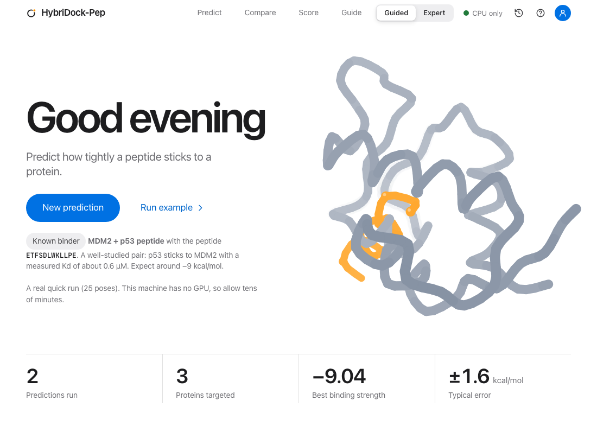

**The one-click way.** On Home, press **Run example**. It runs a Quick prediction of exactly this pair with a known good binding site. Watch the four stages complete, then read the result.

**The step-by-step way**, which is how you will run your own:

1. Press **New prediction**.
2. **Protein:** choose **MDM2**.
3. **Peptide:** press the example `SQETFSDLWKLLP`, or type `ETFSDLWKLLPE`.
4. **Binding site:** keep **I know where it binds** and press **Use the suggested site**. The box snaps onto the pocket where p53 normally sits.
5. **Review:** leave **Quick** selected for a first look, then press **Run prediction**.

When it finishes you land on the result: a big ΔG near −9, a ranked list of poses, and the peptide shown in 3D inside its box. The rest of this guide explains each part.

## Predict binding in detail {#predict}

Open **Predict** in the top bar, or press **New prediction** on Home. There are four steps, shown as bars at the top of the page.

### 1. Protein {#step-protein}

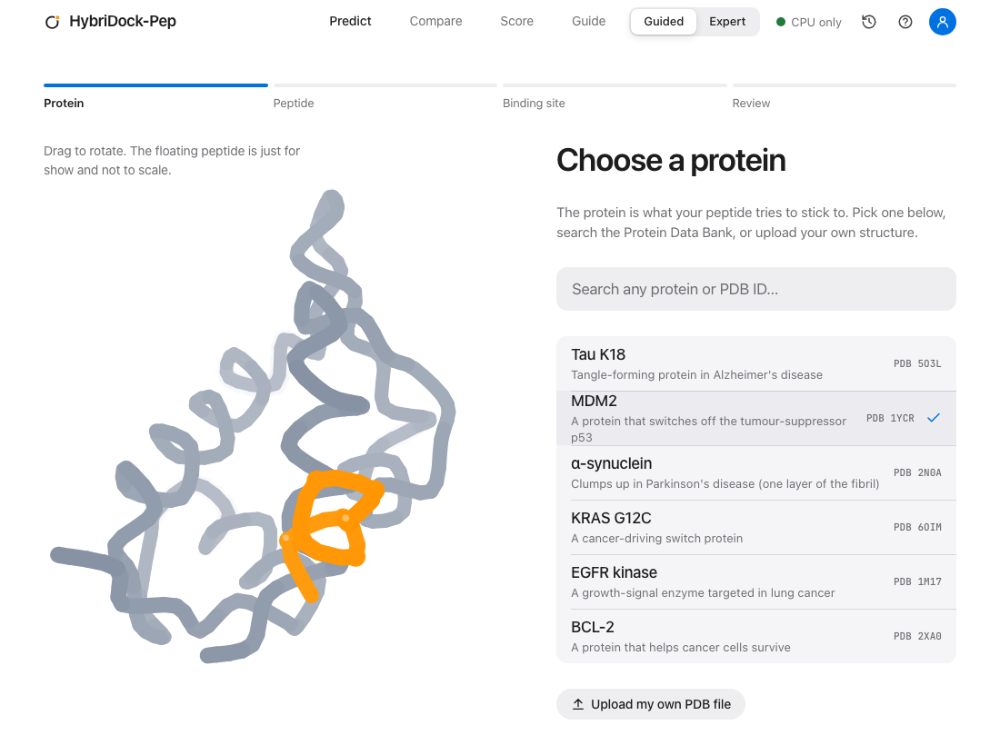

You can use:

- **A built-in protein.** Eight are included: Tau K18 (5O3L), MDM2 (1YCR), α-synuclein (2N0A), KRAS G12C (6OIM), EGFR kinase (1M17), BCL-2 (2XA0), PfLDH (1T2D) and Human LDH (1I0Z). Each comes with a suggested binding site.
- **Any structure from the Protein Data Bank.** Type a four-character ID such as `3LNJ` in the search box, then choose **Load PDB** on the row that appears. It downloads the structure.
- **Your own file.** Press **Upload my own PDB file** and choose a `.pdb` file.

> **Tip:** use a clean structure with the protein only. Remove ligands, waters and other peptides first, or the program may treat them as part of the protein.

### 2. Peptide {#step-peptide}

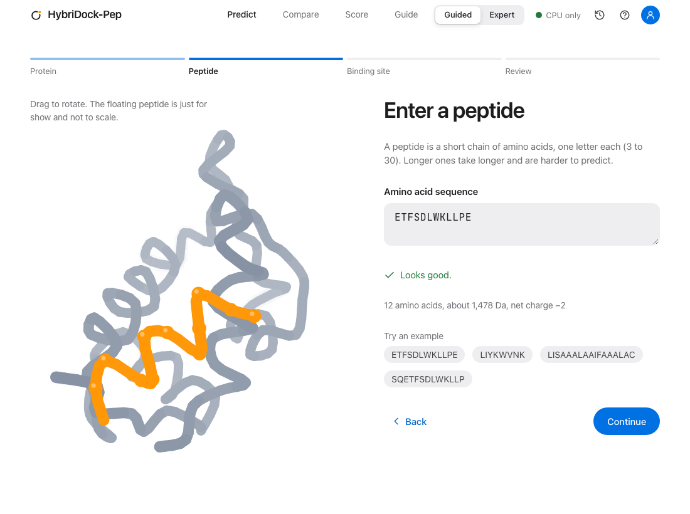

Type the sequence as one-letter codes, for example `LIYKWVNK`.

- **3 to 30 amino acids.** Shorter or longer is refused with a message that says why.
- **Only the 20 standard amino acids:** `ACDEFGHIKLMNPQRSTVWY`. Lower case is fine.
- **Pasted sequences are cleaned for you.** Spaces, line breaks, numbers and a FASTA `>header` line are ignored, and the page tells you when it did so.

Under the box you see the length, approximate weight and net charge. Longer peptides take longer, and above 20 the app warns you. Charged peptides (net charge of 2 or more either way) get a note in the result, because the fast scorer is less reliable for them.

### 3. Binding site {#step-site}

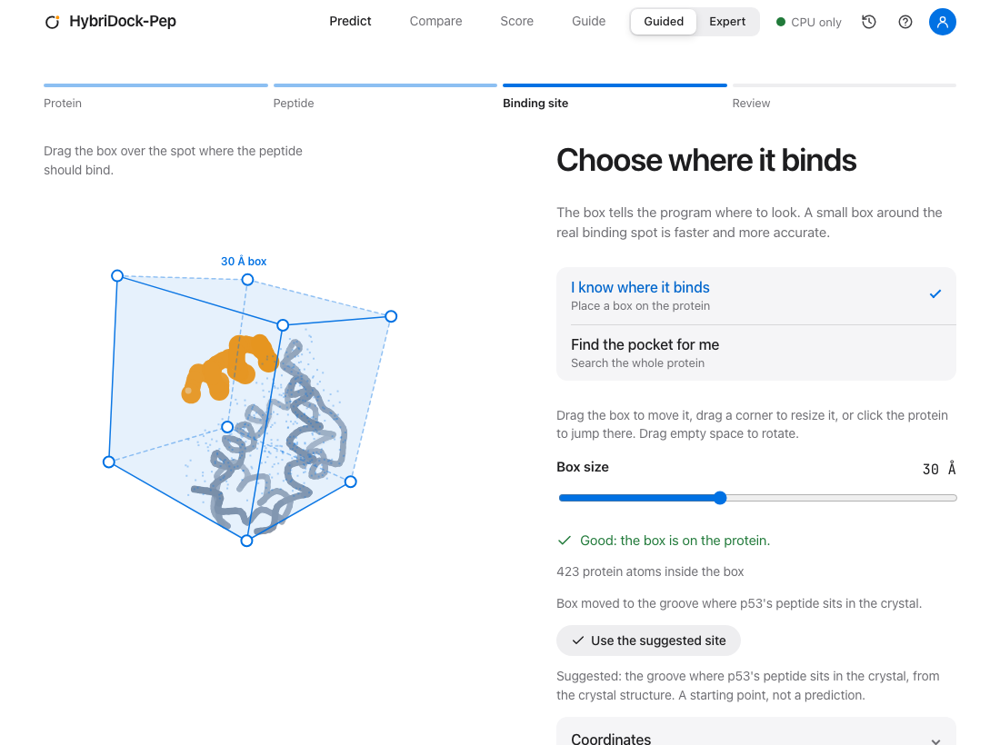

The **box** tells the program where to look. You have two choices:

- **I know where it binds.** A translucent box appears on the protein. Drag it to move, drag a corner or use the slider to resize, or click the protein to jump the box there. Drag empty space to rotate. For built-in proteins, **Use the suggested site** puts it on the known pocket.
- **Find the pocket for me.** The program searches the whole protein, groups the best spots, and docks into each. It is a good first step when you do not know where to aim, but it is **much slower** (see [how long a run takes](#how-long)) and uses more memory.

Box tips: **30 Å** is a good default. A tighter box (20 to 25 Å) around the real pocket is faster and more accurate. The size limits are **10 to 60 Å**. Under the picture the page tells you how many protein atoms are inside the box and warns you if the box is off the protein.

Keyboard users: click the 3D view, then use the arrow keys to move the box, Page Up and Page Down for depth, and plus and minus to resize.

In **Expert** mode, a **Coordinates** drawer shows the exact centre (x, y, z) so you can type numbers.

### 4. Review and run {#step-review}

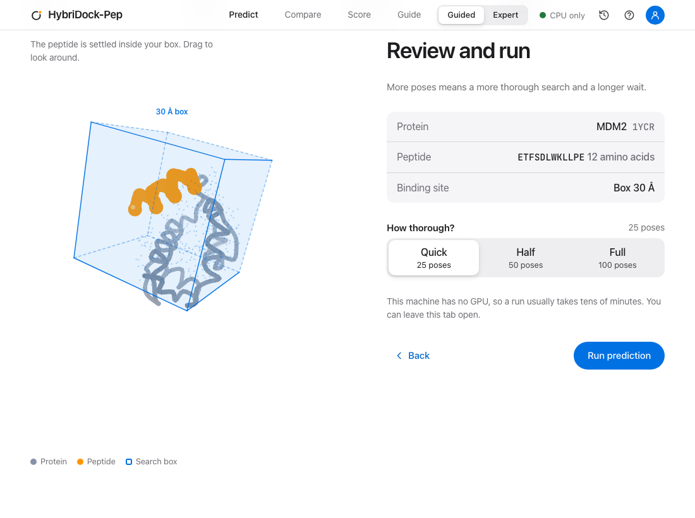

You see a summary of your choices and one setting: **how thorough?**

| Choice | Poses | Use it for |
| --- | --- | --- |
| Quick | 25 | A fast first look |
| Half | 50 | A good balance |
| Full | 100 | The most reliable; use it for results you will act on |

More poses means a more thorough search and a longer wait. Press **Run prediction**.

#### While it runs {#running}

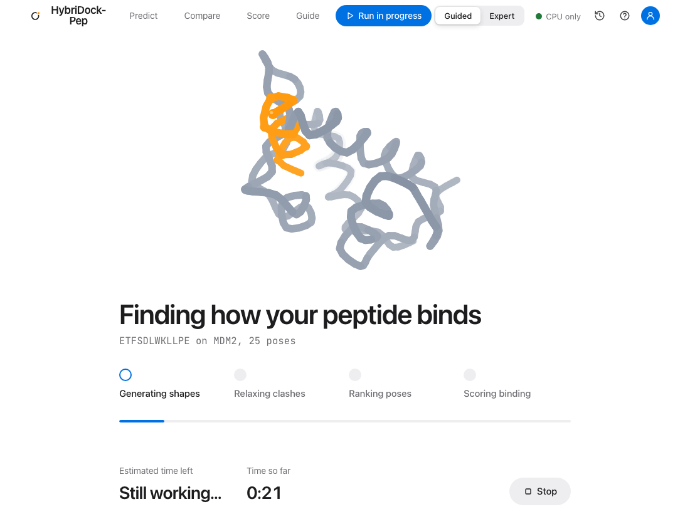

The screen shows four stages: **Generating shapes**, **Relaxing clashes**, **Ranking poses** and **Scoring binding**. On a computer with an NVIDIA or Apple GPU you also get a time estimate. On a CPU-only machine there is no countdown, because we would rather say "tens of minutes" than guess.

- **You can leave.** Switch tabs, open Help or History, or even close the page. The run keeps going on your computer, and the page picks it up again when you return.
- **A pill in the top bar** says **Run in progress** and takes you back to it from any screen.
- **Stop** ends the run and discards it.
- **One run at a time.** Starting a second one is refused with a clear message.

## Reading your result {#results}

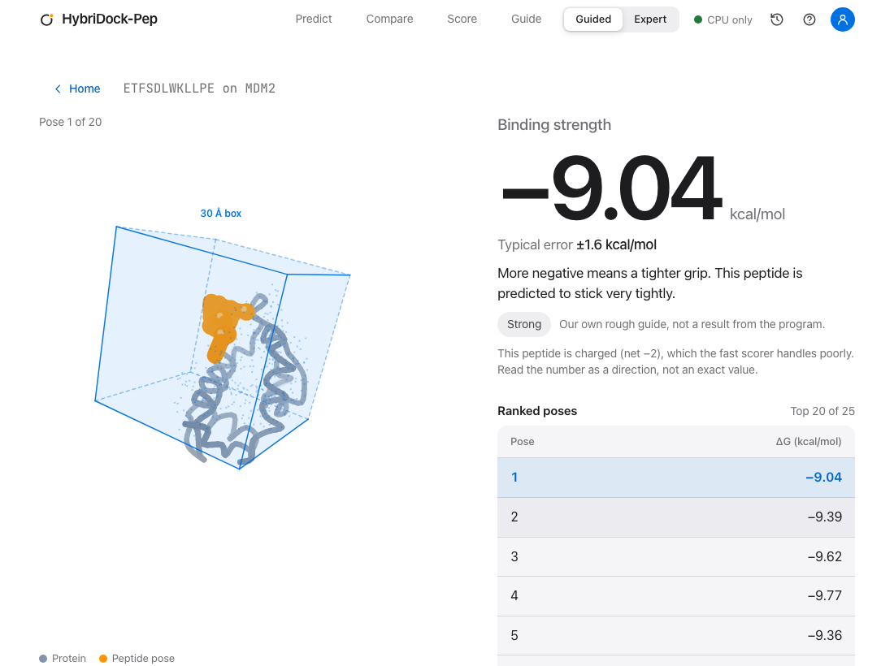

### The big number {#big-number}

**ΔG (kcal/mol)** is the headline. **More negative means a tighter grip.** Right under it is the typical error, ±1.6 kcal/mol, and one plain sentence about what the number suggests.

The chip next to it, **Strong**, **Moderate** or **Weak**, is *our own rough wording* so you can read the number at a glance. The program does not produce it:

| ΔG | Our wording |
| --- | --- |
| −9.0 or lower | Strong |
| between −9.0 and −6.5 | Moderate |
| above −6.5 | Weak |

In **Expert** mode you also see the equivalent **dissociation constant (Kd)**, converted from ΔG at 25 °C, and how large one typical error is in terms of binding strength.

> **Charged peptides.** If the peptide has a net charge of 2 or more, the fast scorer handles it poorly. Read its ΔG as a direction, not an exact value. Expert mode has an **Ultra** setting that adds a correction.

### Ranked poses {#poses}

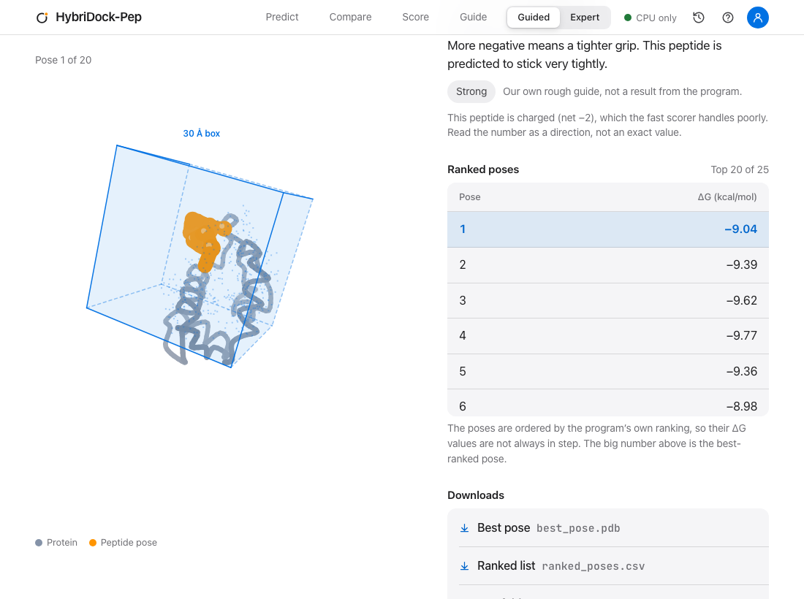

The table lists the best poses. Click a row, or press Enter on it, to see that pose in 3D. The big number is the **best-ranked** pose.

The poses are ordered by the program's own ranking, so their ΔG values are **not always in strict order**. That is expected. In Expert mode the table adds three more columns:

| Column | Meaning |
| --- | --- |
| Ranking score | Orders the poses of **one** protein, lower is stronger. It is **not a ΔG**, and should not be compared with one or across proteins. |
| Clashes | How many atoms overlap the protein. Fewer is better. |
| Cluster | Which family of similar poses it belongs to. |

### The 3D view {#viewer}

Drag the model to rotate it. The peptide is orange and the protein is gray. In a result, the box you used is drawn too. Pick another pose in the table to move the peptide.

### Downloads {#downloads}

| Button | You get |
| --- | --- |
| **Best pose** | `best_pose.pdb`, the top pose, ready for PyMOL, ChimeraX or any viewer |
| **Ranked list** | `ranked_poses.csv`, every pose with `delta_g`, `rank_score` and more |
| **Run folder** | Copies the path of the folder holding everything the run produced (plots, intermediate files, metadata) |

Every run is saved in a folder named after it under `runs/studio/`, inside the folder you started the app from. In Expert mode the result also shows the exact command that was run, so you can reproduce it in a terminal.

## Compare two proteins {#compare}

Open **Compare**. Use it to ask: **does my peptide prefer one protein over another?** That is how you check selectivity, for example a drug target against its look-alike.

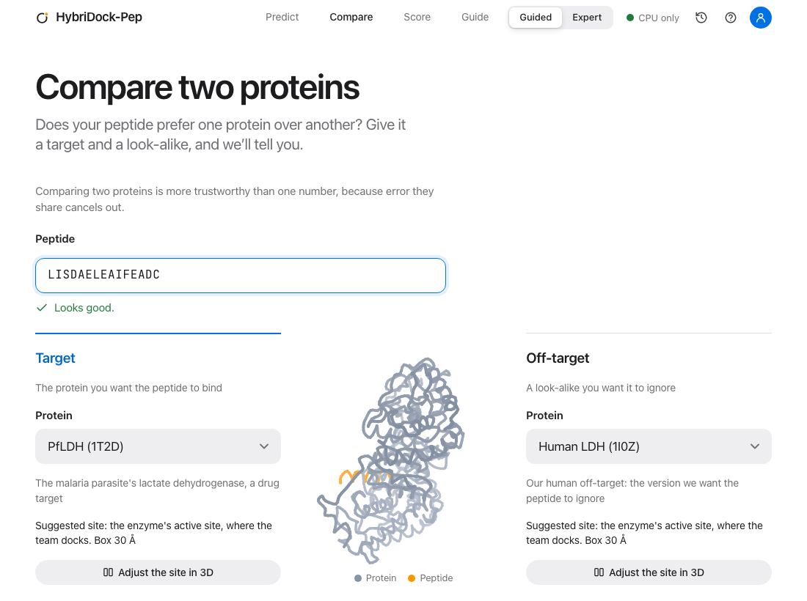

1. Type a **peptide**.
2. Choose the **target** (the protein you want it to bind) and the **off-target** (a look-alike you want it to ignore). They must be different.
3. Use **Adjust the site in 3D** on either side if the suggested site is not right.
4. Choose how thorough, then press **Compare**. It runs **both** dockings, so it takes about twice as long as one prediction.

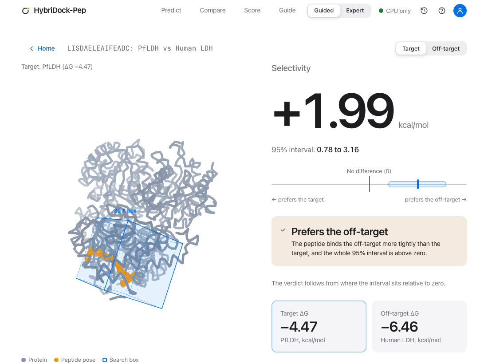

**ΔΔG = ΔG(target) − ΔG(off-target).** A negative number means the peptide prefers the target. The page shows:

- the **95% interval** around ΔΔG (from 1,000 resamples of each side's top 10 poses), drawn as a band against a zero line;
- a **verdict**, decided by where that interval sits: **Selective for the target** (entirely below zero), **Prefers the off-target** (entirely above zero), or **No clear preference** (it crosses zero);
- both ΔG values, and the 3D view for each protein (switch with **Target** and **Off-target** at the top right).

Why comparing is more trustworthy: error that both proteins share, such as a peptide the scorer tends to flatter, cancels out in the difference. Below about **1 kcal/mol** the result is a direction, not a measurement.

> **Run it more than once.** Sampling is random, and a Quick comparison can swing. In our own testing the same Quick comparison of one peptide against two related enzymes gave −1.07 once and +2.58 on a repeat. Treat a Quick comparison as a first look, then confirm with **Full**, and trust a result that repeats.

## Score a structure {#score}

Already have a protein with a peptide bound to it, for instance from a crystal structure or another docking program? Open **Score** to get a ΔG for that exact pose. It does not move anything, it only measures how well it fits. It takes a few seconds and works on any computer, including Windows without WSL2.

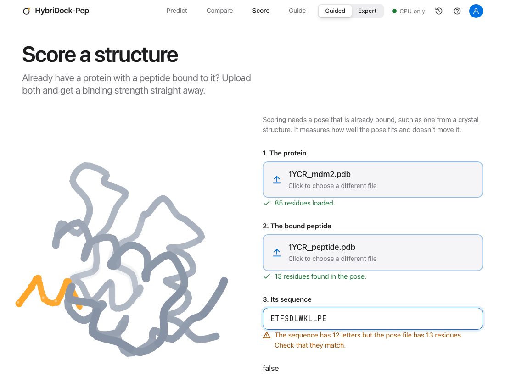

1. Add the **protein** file (protein only, as a `.pdb`). Drag it onto the box or click to browse.
2. Add the **peptide pose** file (just the peptide, in its bound position). The sequence is read from the file and filled in for you.
3. Check the **sequence**. It must have the same number of letters as the residues in the pose file, and the page warns you if not.
4. Press **Score it**.

A good test: the built-in MDM2 and p53 crystal structure should score about **−9.3 kcal/mol**.

## Home, History and your data {#history}

**Home** shows four numbers (predictions run, proteins targeted, best binding strength so far, and the typical error) and your **recent predictions**, with a **Download** button for each ranked list. **See all**, or **History** in the top bar, opens the full list. Choose any run to reopen it, poses and all.

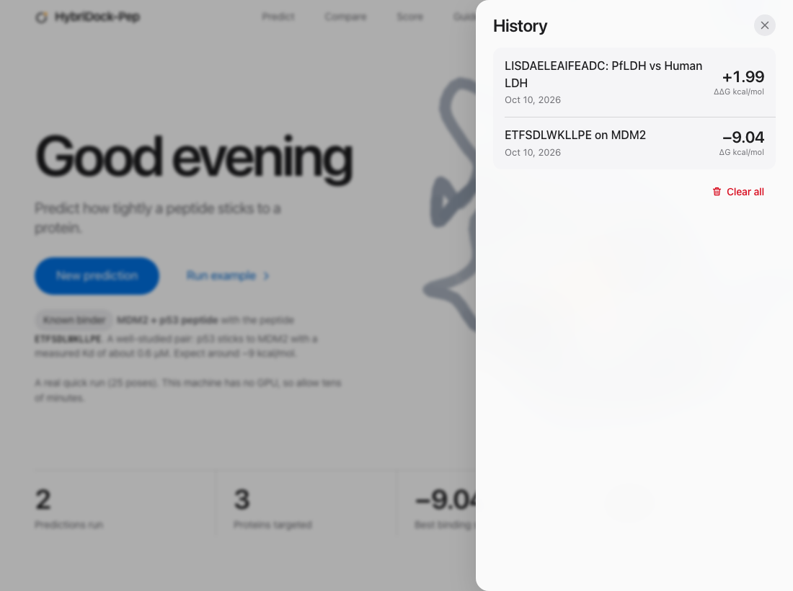

- **Your history lives in your browser**, on this computer. The last 30 runs are kept. **Clear all** empties it. A different browser or a private window starts empty.
- **The files live on the computer running the app**, in `runs/studio/`. Clearing History does not delete them.
- **Nothing is uploaded.** The only outside request the page can make is fetching a structure when you ask for a PDB ID.

## Guided and Expert {#modes}

The switch at the top right changes how much you see, not what the program does.

- **Guided** (the default) hides technical settings and captions and adds short explanations.
- **Expert** shows coordinates, the full ranked table, the dissociation constant, the exact command, and an **Advanced settings** panel on the review step.

The menu behind your **avatar** holds **Appearance** (light or dark, which follows your system at first), an **Accent colour**, and **Your name**, used in the greeting.

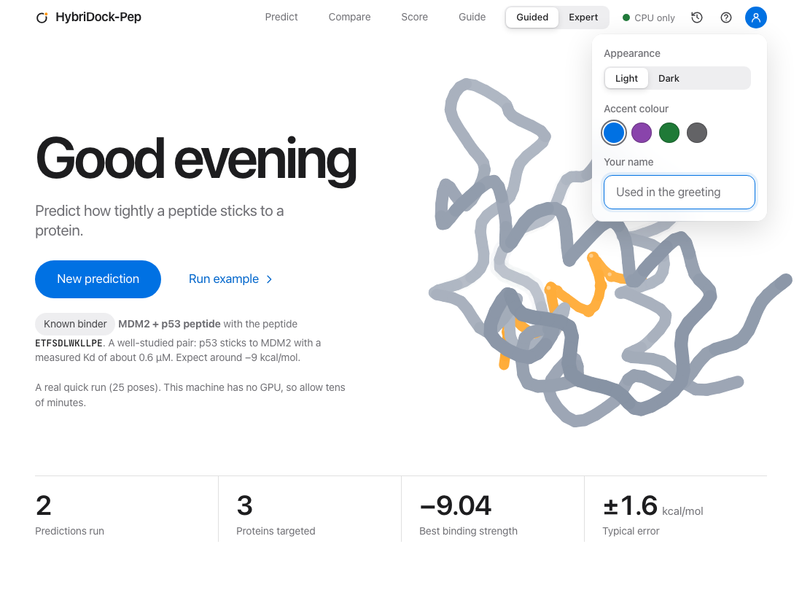

### Expert settings reference {#expert-settings}

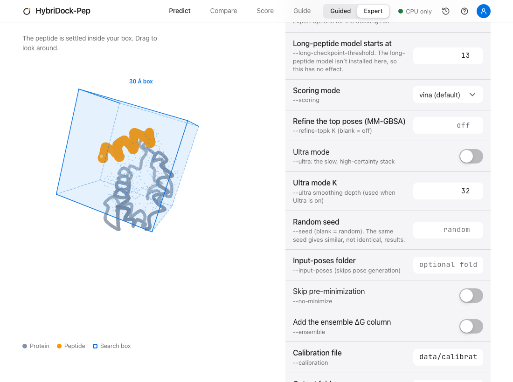

Each setting maps to a command-line option, shown under its name. Leave them alone unless you know why you are changing one.

| Setting | Option | What it does |
| --- | --- | --- |
| Long-peptide model starts at | `--long-checkpoint-threshold` | Peptides at least this long use a specialised model, **if it is installed**. A fresh install does not include it, so this has no effect and the page says so. Range 3 to 30. |
| Scoring mode | `--scoring` | `vina` (default), or `vina,ad4` to also run AutoDock4 for research. The second needs `autogrid4`, which is not available on every platform; if it is missing the option is greyed out. |
| Refine the top poses | `--refine-topk K` | Re-scores the top K poses with MM-GBSA, a slower and more physical method. Range 1 to 50, blank for off. Needs OpenMM. |
| Ultra mode, Ultra mode K | `--ultra K` | The slow, high-certainty tier: smoothed ranking, MM-GBSA, an entropy term, and a correction for charged residues. **Very slow on a CPU**: a run can stall for hours there. |
| Random seed | `--seed` | A fixed seed gives **similar, not identical** poses on a CPU. Range 0 to 2,147,483,647. |
| Input-poses folder | `--input-poses` | Skips pose generation and re-scores poses you already have in a folder on the computer running the app. |
| Skip pre-minimization | `--no-minimize` | Does not relax poses before scoring. |
| Add the ensemble ΔG column | `--ensemble` | Adds an `ensemble_dg` column to the ranked list: a second estimate from a model that blends contact energies with Vina. |
| Calibration file | `--calibration` | The calibration the entropy correction uses. The default is the shipped, validated one. |
| Output folder | `--output-dir` | Where the run is written. Blank means `runs/studio/<run name>`. |

## Getting good predictions {#tips}

- **Pick the site carefully.** A box on the real pocket beats a big box on the whole protein. If you are unsure, use **Find the pocket for me** once, then re-run with a tight box.
- **Match thoroughness to the decision.** Quick to explore, **Full** for anything you will act on.
- **Compare instead of trusting one number.** Two proteins side by side cancel shared error. Repeat important runs.
- **Mind the length.** Short peptides (under about 12 letters) are the most reliable. Past 20 it is slow and harder to predict.
- **Watch for charge.** Peptides rich in D, E, K or R need extra caution.
- **Clean your structures.** Remove ligands, waters and extra chains you do not want docked against.
- **Expect some spread.** Runs are random, and even a fixed seed gives similar rather than identical results on a CPU.

### How long does a run take? {#how-long}

Times depend entirely on your hardware. These are the numbers we have, with the source of each:

| Machine | Quick (25 poses) | Half (50) | Full (100) | Whole-protein search |
| --- | --- | --- | --- | --- |
| NVIDIA RTX 5070 (estimated from per-pose timings) | 1.5 min | 3 min | 6 min | 30 min |
| Apple M3, Metal (estimated from per-pose timings) | 4 min | 7 min | 15 min | 1.5 hours |
| 12-core ARM board, **no GPU** (measured) | 6 min | 11 min | 21 min | 2 hours |

Add about **10 minutes, once**, to the first prediction on a computer for the model download and setup. Whole-protein search also wants 16 GB of memory or more, so run nothing else beside it.

## Troubleshooting {#troubleshooting}

| What you see | What it means and what to do |
| --- | --- |
| **Setup isn't finished on this computer** on Home | Something the app needs is missing. The notice names it and gives the command that fixes it, usually `./install.sh` or one `conda` or `pip` line. |
| **Setup needed** in the top bar | The same thing. Click it to see each check. |
| **Another run is already going** | The app runs one prediction at a time. Wait, use **Run in progress** in the top bar, or Stop it. |
| **The docking engine isn't installed on this computer** | This machine was set up only for scoring. Run `./install.sh` to add the sampler. **Score** still works. |
| **No pose fit at this site** | Every pose overlapped the protein, so there is no ΔG. Move the box to a more open spot, enlarge it, or try a shorter peptide. A site inside a tightly packed structure often does this. |
| **The computer ran out of memory** | Close other programs, use **Quick**, or a shorter peptide. Whole-protein search needs the most. |
| **The run was stopped from outside** | Something other than the page ended it: a restart, or the computer's owner. Start it again. |
| **The server restarted during your run** | The run was lost when the app restarted. Start it again. |
| **Couldn't reach the server** | The app stopped, or your connection (for example an SSH tunnel) dropped. A run already going keeps going: restart the app or the tunnel, reload, and press **Check again**. |
| **That pose couldn't be scored** (Score) | The pose must be the peptide alone, bound to the protein you uploaded, with a sequence of the same length. |
| The first run seems stuck | It is downloading about 2.5 GB and building lookup tables. The page says so. Open Expert mode and the live log shows progress. |
| Port 8000 is busy | The app picks the next free port and prints the address. Or choose one: `./launch_web.sh --port 9000`. |
| **Vina + AD4** is greyed out | `autogrid4` is not installed (it has no build for ARM Linux). Plain Vina is the default and gives the same headline ΔG. |
| A blank page or a "text/plain" error on Windows | Update to the latest version (`git pull`); older versions mis-served the app's script file. |
| The page works but the 3D view is empty | Your browser may have blocked canvas drawing, or the structure is huge. Try another browser, or a smaller structure. |

In Expert mode every error also has a **Technical details** section with the program's own message. Include it if you report a problem at [github.com/Tasty-Ramen2010/hybridock-pep/issues](https://github.com/Tasty-Ramen2010/hybridock-pep/issues).

## Questions people ask {#faq}

**Do I need a GPU?** No. It runs on a plain CPU, just more slowly (tens of minutes for a Full run). NVIDIA GPUs and Apple Silicon are the fast paths.

**Is my data private?** Yes. Everything runs on your computer, or the Colab session you start. The demo website simulates results in your browser and uploads nothing.

**Can I use my own protein?** Yes: upload a `.pdb`, or type a PDB ID. Clean it first (see [Protein](#step-protein)).

**How accurate is it?** A single ΔG is typically within about ±1.6 kcal/mol of the experimental value. It is a good tool for ranking and triage, and a poor one for exact numbers. Compare two proteins when you can.

**Why does the same input give a slightly different answer?** Sampling is random. A fixed seed makes runs similar but, on a CPU, not identical.

**Why are the poses not in perfect ΔG order?** They are ordered by the program's own ranking, which is more reliable than ordering by the headline number alone. The big ΔG is the best-ranked pose.

**What is the difference between ΔG and the ranking score?** ΔG is a binding strength you can compare across peptides. The ranking score only orders the poses of one protein. Never compare it with a ΔG.

**Can two people use it at once?** One app handles one run at a time. Start a second copy on another port, or wait.

**Can I stop a run and keep the partial result?** No: Stop discards the run.

**Where is my result saved?** In `runs/studio/` on the computer running the app, and in your browser's History.

**Does it work offline?** After the install and first run, yes, apart from fetching PDB IDs from the internet.

**How do I cite it, and what is the license?** See the [project page](https://github.com/Tasty-Ramen2010/hybridock-pep) for the license and the technical write-up.

## Glossary {#glossary}

| Term | Meaning |
| --- | --- |
| **Protein** | The large molecule your peptide tries to stick to. Its 3D shape comes from a structure file. |
| **Peptide** | A short chain of amino acids, typed as letters. |
| **PDB** | The Protein Data Bank, a free public library of structures, and the file format they use. |
| **ΔG (binding strength)** | Free energy of binding in kcal/mol. More negative means tighter. |
| **Kd** | The dissociation constant: the concentration at which half the proteins hold a peptide. Smaller means tighter. Related to ΔG by Kd = exp(ΔG / RT). |
| **Pose** | One way the peptide could sit on the protein. |
| **Binding site, box** | Where on the protein to look; the box is the search area, measured in ångströms (Å). One Å is a ten-billionth of a metre. |
| **Blind search** | Searching the whole protein for pockets instead of using a box you placed. |
| **Selectivity, ΔΔG** | The difference between two ΔG values, target minus off-target. |
| **95% interval** | The range the true value is expected to fall in 95 times out of 100. If it crosses zero, there is no clear preference. |
| **Ranking score** | A number that only orders poses of one protein. Not a ΔG. |
| **MM-GBSA** | A physics method that re-scores a pose with a force field. Slower and more physical than the default. |
| **Metal, CUDA** | The graphics-card technologies of Apple and NVIDIA that make sampling fast. |

## Command line {#cli}

Everything the app does is a command you can run yourself. In Expert mode the app shows the exact command for each run. After installing, activate the environment and run:

```bash
conda activate score-env

# the ready-made example: MDM2 and the p53 peptide
hybridock-pep dock --peptide ETFSDLWKLLPE \
  --receptor data/pdbs/1YCR_mdm2.pdb --site 25.20 -25.61 -7.97 --box 30 \
  --n-samples 25 --output-dir runs/demo

# does a peptide prefer one protein over another?
hybridock-pep selectivity --help

# score a bound pose you already have
hybridock-pep crystal-score \
  --receptor data/pdbs/1YCR_mdm2.pdb --peptide-pdb data/pdbs/1YCR_peptide.pdb --peptide ETFSDLWKLLPE

# the web app, a terminal UI, and the built-in help
hybridock-pep serve
./launch_ui.sh
hybridock-pep guide all
```

`hybridock-pep dock --help` lists every option. The web app exposes the ones that matter in Expert mode.
